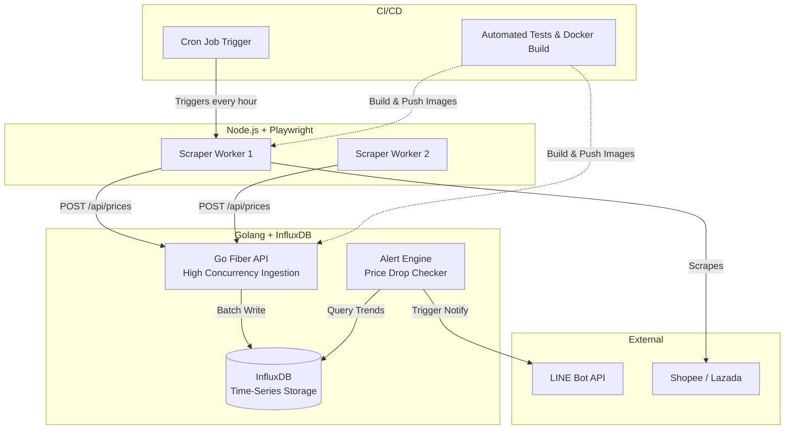

# 🚀 Omni-Tracker: High-Speed Price & Market Intelligence Platform

This is a unified mega-project that combines Golang, Playwright, InfluxDB, Docker, and GitHub Actions.

## 🎯 Project Concept
Instead of physical IoT sensors, our "sensors" are **Playwright Scrapers** running in parallel, tracking thousands of product prices across e-commerce sites. They fire massive amounts of data concurrently to our **Golang Ingestion API**, which logs time-series data into **InfluxDB** (chosen over Redis because price tracking is inherently time-series data). When a price drops, the Go service triggers your existing **LINE Bot API**.

Everything is containerized with **Docker** and deployed via **GitHub Actions**.

---

## 🏗️ Architecture



---

## 📁 Project Structure

```text
omni-tracker/
├── .github/workflows/
│   └── ci.yml               # GitHub Actions CI/CD Pipeline
├── api/                     # Golang Backend
│   ├── main.go              # Go Ingestion API & Alert Engine
│   ├── go.mod
│   └── Dockerfile
├── scraper/                 # Playwright Scraper
│   ├── index.js             # Node.js scraping logic
│   ├── package.json
│   └── Dockerfile
└── docker-compose.yml       # Orchestrates Go, Node, and InfluxDB
```

---

## 💻 1. The Golang API (`api/main.go`)
*Uses Go Fiber for extreme speed and InfluxDB for time-series metrics.*

```go
package main

import (
	"context"
	"fmt"
	"log"
	"time"

	"github.com/gofiber/fiber/v2"
	influxdb2 "github.com/influxdata/influxdb-client-go/v2"
)

// PricePayload struct matches the JSON from Playwright
type PricePayload struct {
	ProductID string  `json:"product_id"`
	Store     string  `json:"store"`
	Price     float64 `json:"price"`
}

func main() {
	app := fiber.New()

	// InfluxDB Connection (Time-Series DB is best for price history)
	client := influxdb2.NewClient("http://influxdb:8086", "super-secret-token")
	writeAPI := client.WriteAPIBlocking("my-org", "market-data")

	// Ingestion Endpoint (High Concurrency)
	app.Post("/api/prices", func(c *fiber.Ctx) error {
		p := new(PricePayload)
		if err := c.BodyParser(p); err != nil {
			return c.Status(400).JSON(fiber.Map{"error": "invalid payload"})
		}

		// Create InfluxDB Point
		point := influxdb2.NewPointWithMeasurement("product_price").
			AddTag("store", p.Store).
			AddTag("product_id", p.ProductID).
			AddField("price", p.Price).
			SetTime(time.Now())

		// Write to DB
		err := writeAPI.WritePoint(context.Background(), point)
		if err != nil {
			log.Printf("DB Write Error: %v", err)
			return c.Status(500).SendString("DB Error")
		}

		// TODO: Trigger LINE Bot API if price < threshold
		// http.Post("http://your-line-bot-api/notify", ...)

		return c.SendStatus(200)
	})

	log.Fatal(app.Listen(":3000"))
}
```

---

## 💻 2. The Playwright Scraper (`scraper/index.js`)
*Headless browser bot that scrapes e-commerce sites and acts as our "Sensors".*

```javascript
const { chromium } = require('playwright');
const axios = require('axios');

(async () => {
    console.log('🚀 Starting E-commerce Scraper...');
    const browser = await chromium.launch({ headless: true });
    const page = await browser.newPage();

    try {
        // Example: Go to a dummy product page (Replace with real URL)
        await page.goto('https://example-ecommerce.com/product/123');
        
        // Wait for price element and extract text
        // Note: Real Shopee/Lazada selectors change often
        const priceText = await page.locator('.product-price').innerText();
        const priceValue = parseFloat(priceText.replace(/[^0-9.-]+/g, ""));

        const payload = {
            product_id: "iphone-15-pro",
            store: "shopee",
            price: priceValue
        };

        console.log(`📦 Scraped Price: ${payload.price} THB`);

        // Send to Go High-Speed API
        await axios.post('http://go-api:3000/api/prices', payload);
        console.log('✅ Sent to Ingestion API');

    } catch (error) {
        console.error('❌ Scraping failed:', error.message);
    } finally {
        await browser.close();
    }
})();
```

---

## 💻 3. Docker Orchestration (`docker-compose.yml`)
*Runs the entire ecosystem with one command: `docker-compose up -d`.*

```yaml
version: '3.8'

services:
  influxdb:
    image: influxdb:2.7
    ports:
      - "8086:8086"
    environment:
      - DOCKER_INFLUXDB_INIT_MODE=setup
      - DOCKER_INFLUXDB_INIT_USERNAME=admin
      - DOCKER_INFLUXDB_INIT_PASSWORD=adminpassword
      - DOCKER_INFLUXDB_INIT_ORG=my-org
      - DOCKER_INFLUXDB_INIT_BUCKET=market-data
      - DOCKER_INFLUXDB_INIT_ADMIN_TOKEN=super-secret-token
    volumes:
      - influxdb-data:/var/lib/influxdb2

  go-api:
    build: ./api
    ports:
      - "3000:3000"
    depends_on:
      - influxdb

  scraper-worker:
    build: ./scraper
    depends_on:
      - go-api
    # Restarts automatically if it crashes
    restart: on-failure

volumes:
  influxdb-data:
```

*(Note: The Go and Scraper folders will each need a standard `Dockerfile`)*

---

## 💻 4. GitHub Actions CI/CD (`.github/workflows/ci.yml`)
*Automates testing and builds Docker images on every push.*

```yaml
name: CI/CD Pipeline

on:
  push:
    branches: [ "main" ]
  pull_request:
    branches: [ "main" ]

jobs:
  test-and-build-go:
    runs-on: ubuntu-latest
    steps:
    - uses: actions/checkout@v3
    
    - name: Set up Go
      uses: actions/setup-go@v4
      with:
        go-version: '1.21'
        
    - name: Run Go Tests
      working-directory: ./api
      run: go test ./...
      
    - name: Build Go Docker Image
      run: docker build -t thitipongroo/omni-go-api:latest ./api

  test-and-build-scraper:
    runs-on: ubuntu-latest
    steps:
    - uses: actions/checkout@v3
    
    - name: Set up Node.js
      uses: actions/setup-node@v3
      with:
        node-version: '18'
        
    - name: Build Playwright Docker Image
      run: docker build -t thitipongroo/omni-scraper:latest ./scraper
```
