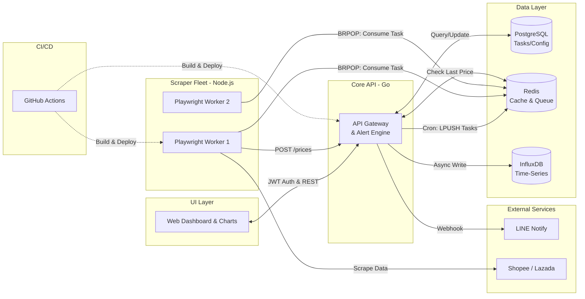

# 🚀 Omni-Tracker: Market Intelligence Platform (v3.0)

[](https://go.dev/)
[](https://nodejs.org/)
[](https://playwright.dev/)
[](https://www.postgresql.org/)
[](https://redis.io/)
[](https://www.influxdata.com/)
[](https://www.docker.com/)
[](https://github.com/features/actions)

**Omni-Tracker** is a distributed, high-concurrency market intelligence platform. It treats web scrapers as "IoT sensors" that ingest thousands of data points concurrently. Version 3.0 elevates the system to an Enterprise-grade Architecture by introducing **Clean Architecture in Go**, **Redis Message Queues** for concurrency control, and **Advanced Data Visualization**.

## ✨ Features

- **Go Clean Architecture:** Backend heavily refactored into a scalable Standard Go Layout (Handlers, Services, Repositories).
- **Redis Task Queue:** Go API automatically schedules and pushes scraping tasks into a Redis Queue (`LPUSH`). Node.js workers act as isolated consumers (`BRPOP`) to eliminate memory leaks and overlapping cron jobs.
- **Relational Task Management:** Uses **PostgreSQL + GORM** to dynamically manage active URLs and track the real-time status of scrapers (`SUCCESS` / `FAILED`).
- **Data Visualization & Analytics:** A beautiful **Chart.js** modal integrated with **InfluxDB** historical price data directly on the Dashboard.
- **Secure Dashboard Authentication:** Web UI protected by token-based Admin Login.
- **Dynamic DOM Extractors:** Change scraping CSS selectors (e.g. Shopee/Lazada classes) on the fly via the Dashboard without touching source code.
- **Advanced Headless Scraping:** Leverages **Playwright + Stealth Plugin** to bypass modern e-commerce anti-bot protections.
- **Event-Driven Alerts:** Real-time notifications via LINE Messaging API when prices drop.
- **Automated CI/CD:** GitHub Actions pipeline for linting, testing, and building Docker images.

---

## 🏗️ System Architecture



---

## 🚀 Getting Started

### Prerequisites
- Docker & Docker Compose
- LINE Notify Token (Optional, for alerts)

### Installation & Run

1. **Clone the repository:**
   ```bash
   git clone https://github.com/thitipongroo/omni-tracker.git
   cd omni-tracker
   ```

2. **Configure Environment Variables:**
   Edit the `.env` file and insert your `LINE_NOTIFY_TOKEN` (or leave it blank to disable alerts). You can also configure `ADMIN_PASSWORD` (default: `admin123`).

3. **Start the ecosystem via Docker:**
   ```bash
   docker-compose up -d --build
   ```
   *This command spins up PostgreSQL, Redis, InfluxDB, the Golang API, and the Scraper Worker fleet.*

4. **Access the Dashboard:**
   Open your browser and navigate to: [http://localhost:3000](http://localhost:3000)
   *(Default Login Password: `admin123`)*

---

## 📁 Project Structure

```text
omni-tracker/
├── .github/workflows/
│   └── ci.yml               # GitHub Actions CI/CD Pipeline
├── api/                     # Golang Backend 
│   ├── internal/            # Clean Architecture Core
│   │   ├── config/          # Environment configuration
│   │   ├── handler/         # HTTP Routing & Auth logic
│   │   ├── models/          # Structs & Data models
│   │   ├── repository/      # GORM, Redis, and InfluxDB instances
│   │   └── service/         # Task Scheduler & Alerting logic
│   ├── main.go              # Entry Point
│   ├── main_test.go         # Unit Tests
│   └── Dockerfile
├── dashboard/               # Frontend UI (Vanilla HTML/CSS/JS)
│   ├── index.html           # Authentication, Forms, Modals
│   ├── style.css
│   └── app.js               # Chart.js and API integrations
├── scraper/                 # Node.js Scraper (Playwright, Redis Queue)
│   ├── Dockerfile
│   ├── index.js             # Message Queue Consumers (Workers)
│   └── package.json
├── docker-compose.yml       # Orchestrates the microservice stack
├── .env                     # Configuration and secrets
└── .gitignore               # Ignored files
```

---

## 🤝 Contributing
Contributions are welcome! Please feel free to submit a Pull Request or open an Issue.

## 📝 License
This project is licensed under the MIT License.
