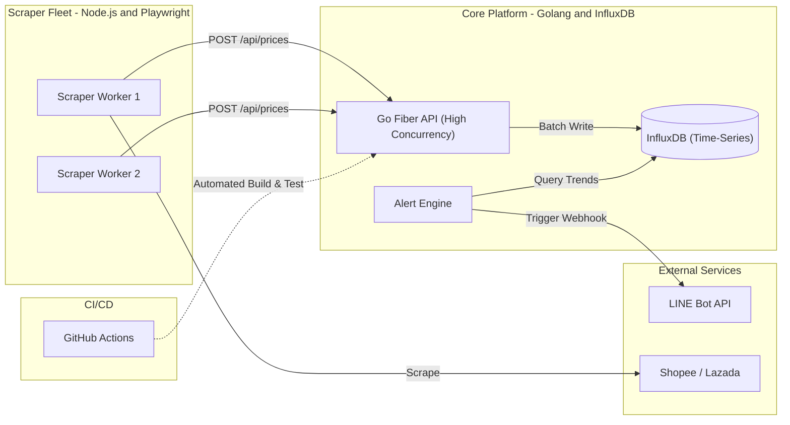

# 🚀 Omni-Tracker: High-Speed Price & Market Intelligence Platform

[](https://go.dev/)
[](https://playwright.dev/)
[](https://www.influxdata.com/)
[](https://www.docker.com/)
[](https://github.com/features/actions)

**Omni-Tracker** is a distributed, high-concurrency market intelligence platform. It treats web scrapers as "IoT sensors" that ingest thousands of data points (prices, stock statuses) concurrently into a Golang-based API, storing the metrics in a time-series database for trend analysis and real-time alerts.

## ✨ Features

- **High-Concurrency Ingestion:** Built with Go Fiber to handle massive traffic spikes from parallel scraping workers without bottlenecking.
- **Time-Series Storage:** Utilizes InfluxDB for optimized storage and querying of historical price changes and market trends.
- **Headless Browser Automation:** Leverages Playwright to bypass modern e-commerce anti-bot protections and extract dynamic data.
- **Event-Driven Alerts:** Evaluates price drops in real-time and triggers notifications via the LINE Messaging API.
- **Fully Containerized:** The entire ecosystem (Go API, Node.js Scrapers, InfluxDB) is orchestrated via Docker Compose.
- **Automated CI/CD:** GitHub Actions pipeline for linting, testing, and building Docker images on every push.

---

## 🏗️ System Architecture



---

## 🚀 Getting Started

### Prerequisites
- Docker & Docker Compose
- Go 1.21+
- Node.js 18+

### Installation & Run

1. **Clone the repository:**
   ```bash
   git clone https://github.com/thitipongroo/omni-tracker.git
   cd omni-tracker
   ```

2. **Start the ecosystem via Docker:**
   ```bash
   docker-compose up -d --build
   ```
   *This command spins up the InfluxDB instance, the Golang API on port 3000, and the Playwright scraper workers.*

3. **Verify the API is running:**
   ```bash
   curl http://localhost:3000/health
   ```

---

## 📁 Project Structure

- `/api` - Golang ingestion API and alerting engine.
- `/scraper` - Node.js and Playwright scraping scripts.
- `/.github/workflows` - CI/CD pipelines.
- `docker-compose.yml` - Infrastructure orchestration.

---

## 🤝 Contributing
Contributions are welcome! Please feel free to submit a Pull Request or open an Issue.

## 📝 License
This project is licensed under the MIT License.
