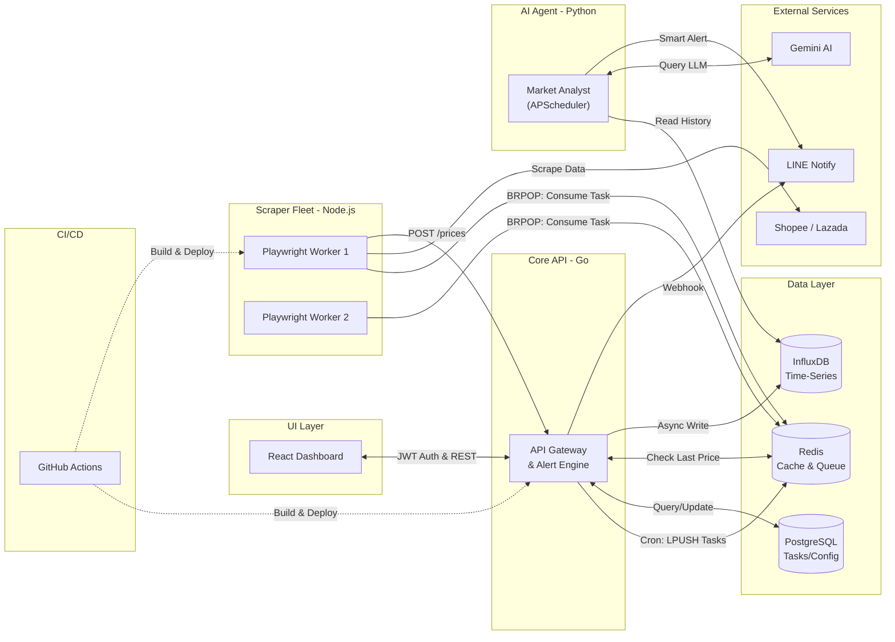

# 🚀 Omni-Tracker: Market Intelligence Platform (v3.1)

[](https://go.dev/)
[](https://nodejs.org/)
[](https://reactjs.org/)
[](https://vitejs.dev/)
[](https://tailwindcss.com/)
[](https://playwright.dev/)
[](https://www.postgresql.org/)
[](https://redis.io/)
[](https://www.influxdata.com/)
[](https://www.docker.com/)
[](https://github.com/features/actions)

**Omni-Tracker** is a distributed, high-concurrency market intelligence platform. It treats web scrapers as "IoT sensors" that ingest thousands of data points concurrently. Version 3.1 elevates the system to an Enterprise-grade Architecture by introducing **Clean Architecture in Go**, **React + Vite Dashboard**, **Redis Message Queues** for concurrency control, and robust **Security & Performance Patches**.

## ✨ Features

- **Modern Frontend (React + Vite):** A beautiful, responsive dashboard built with React 19, TailwindCSS, and Lucide icons.
- **Go Clean Architecture:** Backend heavily refactored into a scalable Standard Go Layout (Handlers, Services, Repositories).
- **Redis Task Queue:** Go API automatically schedules and pushes scraping tasks into a Redis Queue (`LPUSH`). Node.js workers act as isolated consumers (`BRPOP`) to eliminate memory leaks and overlapping cron jobs.
- **Relational Task Management:** Uses **PostgreSQL + GORM** with optimized database indexes to dynamically manage active URLs and track the real-time status of scrapers (`SUCCESS` / `FAILED`).
- **Data Visualization & Analytics:** A beautiful **Recharts/Chart.js** modal integrated with **InfluxDB** historical price data directly on the Dashboard.
- **Enterprise-Grade Security:**
  - Token-based Admin Login with **Bcrypt Password Hashing**.
  - **SSRF (Server-Side Request Forgery) Protection** with strict URL Validation and Domain Whitelisting.
  - **InfluxQL Injection Prevention**.
  - **Rate Limiting** on critical endpoints to prevent DoS attacks.
  - **Environment Variable Enforcement** ensuring critical secrets are strictly configured.
- **Advanced Headless Scraping:** Leverages **Playwright + Stealth Plugin** to bypass modern e-commerce anti-bot protections. NetworkIdle-based synchronization maximizes throughput.
- **Event-Driven Alerts:** Real-time notifications via LINE Messaging API when prices drop.
- **Agentic AI (Market Analyst):** A Python microservice that fetches weekly pricing data from InfluxDB and uses **Gemini AI** to provide smart analysis and personalized recommendations directly via LINE Notify. It now runs continuously as a background service powered by **APScheduler**.
- **Automated CI/CD:** GitHub Actions pipeline for linting, testing, and building Docker images.

---

## 🏗️ System Architecture



---

## 🚀 Getting Started

### Prerequisites
- Docker & Docker Compose
- LINE Notify Token (Optional, for alerts)

### Installation & Run

1. **Clone the repository:**
   ```bash
   git clone https://github.com/thitipongroo/omni-tracker.git
   cd omni-tracker
   ```

2. **Configure Environment Variables:**
   Edit the `.env` file and insert your `LINE_NOTIFY_TOKEN` (or leave it blank to disable alerts). You MUST provide `API_KEY` and `JWT_SECRET` for the system to boot securely.

3. **Start the ecosystem via Docker:**
   ```bash
   docker-compose up -d --build
   ```
   *This command spins up PostgreSQL, Redis, InfluxDB, the Golang API (which statically serves the pre-built React frontend), and the Scraper Worker fleet.*

4. **Access the Dashboard:**
   Open your browser and navigate to: [http://localhost:3000](http://localhost:3000)
   *(Default Login Credentials - Username: `admin` / Password: `password123`)*

### 🤖 Running the AI Market Analyst (Agentic AI)

The AI service (`ai-analyst`) now runs automatically as part of the `docker-compose up -d --build` stack using **APScheduler**.

**To configure it:**
1. Ensure you have added both `LINE_NOTIFY_TOKEN` and `GEMINI_API_KEY` in your `.env` file.
2. The `ai-analyst` container will boot up automatically alongside the API and databases, scheduling periodic background jobs to fetch data from InfluxDB and generate insights.

*(If you wish to run it manually without Docker for development):*
```bash
cd analyst
pip install -r requirements.txt
python main.py
```

---

## 📁 Project Structure

```text
omni-tracker/
├── api/                     # Golang Backend 
│   ├── internal/            # Clean Architecture Core
│   │   ├── config/          # Environment configuration
│   │   ├── handler/         # HTTP Routing, Auth, Rate Limiting
│   │   ├── models/          # Structs & Data models (GORM)
│   │   ├── repository/      # GORM, Redis, and InfluxDB instances
│   │   └── service/         # Task Scheduler & Alerting logic
│   ├── main.go              # Entry Point
│   ├── main_test.go         # Unit Tests
│   └── Dockerfile
├── dashboard/               # Frontend UI (React + Vite + Tailwind)
│   ├── src/                 # React Components
│   ├── package.json         
│   ├── vite.config.js       
│   └── tailwind.config.js   
├── scraper/                 # Node.js Scraper (Playwright, Redis Queue)
│   ├── Dockerfile
│   ├── index.js             # Message Queue Consumers (Workers)
│   └── package.json
├── analyst/                 # Agentic AI Microservice (Python + Gemini + APScheduler)
│   ├── main.py              # AI Daemon Service (Scheduler)
│   ├── market_analyst.py    # Core Analysis Logic
│   ├── Dockerfile
│   └── requirements.txt
├── docker-compose.yml       # Orchestrates the microservice stack
├── .env                     # Configuration and secrets
└── .gitignore               # Ignored files
```

---

## 🤝 Contributing
Contributions are welcome! Please feel free to submit a Pull Request or open an Issue.

## 📝 License
This project is licensed under the MIT License.
