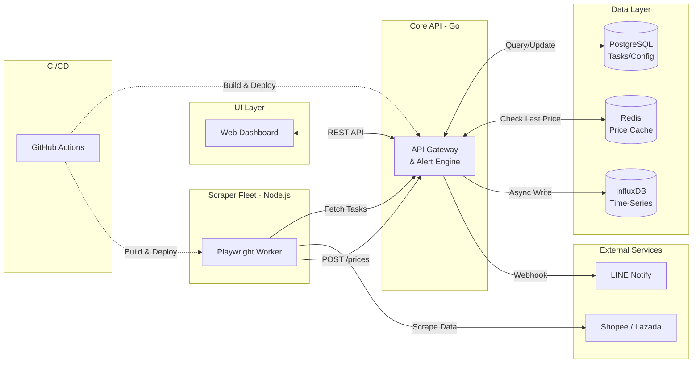

# 🚀 Omni-Tracker: Market Intelligence Platform (v2.0)

[](https://go.dev/)
[](https://nodejs.org/)
[](https://playwright.dev/)
[](https://www.postgresql.org/)
[](https://redis.io/)
[](https://www.influxdata.com/)
[](https://www.docker.com/)
[](https://github.com/features/actions)

**Omni-Tracker** is a distributed, high-concurrency market intelligence platform. It treats web scrapers as "IoT sensors" that ingest thousands of data points concurrently. Version 2.0 introduces a robust microservices architecture featuring a centralized Database, Caching layer, and a beautiful Web Dashboard.

## ✨ Features (v2.0)

- **High-Concurrency Ingestion:** Built with Go Fiber to handle massive traffic spikes.
- **Relational Task Management:** Uses **PostgreSQL + GORM** to dynamically manage and distribute scraping tasks via REST API.
- **Ultra-Fast Alerting Engine:** Utilizes **Redis** as an in-memory cache to evaluate price drops in milliseconds, drastically reducing read-load on the primary time-series DB.
- **Time-Series Storage:** Stores historical price trends and fluctuations in **InfluxDB** for deep analytics.
- **Advanced Headless Scraping:** Leverages **Playwright + Stealth Plugin** to bypass modern e-commerce anti-bot protections.
- **Smart Concurrency & Looping:** Node.js worker automatically loops via `node-cron` and processes tasks in concurrent chunks using `Promise.all`.
- **Glassmorphism Dashboard:** A stunning Vanilla HTML/CSS/JS frontend to manage tracked products and view active scraping tasks.
- **Automated CI/CD:** GitHub Actions pipeline for linting, testing, and building Docker images.
- **Event-Driven Alerts:** Real-time notifications via LINE Messaging API when prices drop.

---

## 🏗️ System Architecture



---

## 🚀 Getting Started

### Prerequisites
- Docker & Docker Compose
- LINE Notify Token (Optional, for alerts)

### Installation & Run

1. **Clone the repository:**
   ```bash
   git clone https://github.com/thitipongroo/omni-tracker.git
   cd omni-tracker
   ```

2. **Configure Environment Variables:**
   Edit the `.env` file and insert your `LINE_NOTIFY_TOKEN` (or leave it blank to disable alerts).

3. **Start the ecosystem via Docker:**
   ```bash
   docker-compose up -d --build
   ```
   *This command spins up PostgreSQL, Redis, InfluxDB, the Golang API, and the Scraper Worker.*

4. **Access the Dashboard:**
   Open your browser and navigate to: [http://localhost:3000](http://localhost:3000)

---

## 📁 Project Structure

```text
omni-tracker/
├── .github/workflows/
│   └── ci.yml               # GitHub Actions CI/CD Pipeline
├── api/                     # Golang Backend (Fiber, GORM, Redis, InfluxDB)
│   ├── Dockerfile
│   ├── go.mod
│   └── main.go
├── dashboard/               # Frontend UI (Vanilla HTML/CSS/JS)
│   ├── index.html
│   ├── style.css
│   └── app.js
├── scraper/                 # Node.js Scraper (Playwright, Stealth, Cron)
│   ├── Dockerfile
│   ├── index.js
│   └── package.json
├── docker-compose.yml       # Orchestrates the entire microservice stack
├── .env                     # Configuration and secrets
└── .gitignore               # Ignored files
```

---

## 🤝 Contributing
Contributions are welcome! Please feel free to submit a Pull Request or open an Issue.

## 📝 License
This project is licensed under the MIT License.
